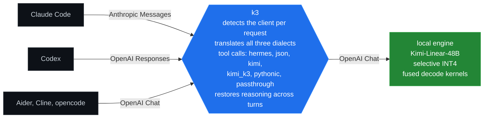

# local-kimi


<sub>Sketch is illustrative. This repository serves Kimi-Linear-48B, measured on an NVIDIA L40S inside a hard 32 GiB cap. The full Kimi K3 is 2.78T parameters and runs on an 8x B300 node, linked below.</sub>

> **TL;DR.** Run Kimi on your own consumer GPU, not someone's API. A single
> 32 GB card (RTX 5090, or any datacenter card) serves Kimi-Linear-48B at
> **113.83 tok/s**, up **3.18x** from fused INT4 kernels, and Claude Code,
> Codex, Cline, Aider and opencode all connect to it unchanged.
>
> **Need the full Kimi K3 in production?** 2.8 trillion parameters will not fit
> a workstation. If you want it running inside your own network instead of
> behind a closed-source API, RunInfra ships it as a deployable package with a
> pinned vLLM build, a benchmark receipt and weight verification:
> **[Kimi K3 on 8x B300 →](https://runinfra.ai/catalog/kimi-k3-b300x8-k3turbo)**

Point any coding agent at a local Kimi model and it works: `k3` translates between the agent's protocol and the model's.

[](docs/CLAUDE-CODE.md)
[](docs/CODEX.md)
[](k3/presets.py)
[](k3/presets.py)
[](k3/presets.py)
[](docs/OPENAI-SDK.md)



## The problem

Local model servers usually speak OpenAI Chat Completions. Claude Code speaks Anthropic Messages. Codex speaks OpenAI Responses. Point the wrong client at the wrong endpoint and the request fails. `k3` sits between them, detects the caller on each request, and translates the request and response.

## Protocol support

The protocol landscape has changed. Current releases of [vLLM](https://docs.vllm.ai/en/stable/serving/online_serving/), [llama.cpp](https://github.com/ggml-org/llama.cpp/blob/master/tools/server/README.md), and [Ollama](https://docs.ollama.com/api/openai-compatibility) now document all three protocol families. `k3` is different because it is a standalone adapter for an existing OpenAI Chat Completions backend.

| Capability | vLLM | llama.cpp | Ollama | `k3` |
| --- | --- | --- | --- | --- |
| OpenAI Chat Completions | Documented | Documented | Documented | Verified |
| OpenAI Responses | Documented | Documented | Documented, non-stateful | Verified |
| Anthropic Messages | Documented | Documented | Documented | Verified |
| Serves model inference itself | Yes | Yes | Yes | No, proxy only |
| Detects a client preset from route, headers, user agent, and body hints | Not documented | Not documented | Not documented | Verified |
| Translates tool calls to and from a separate OpenAI Chat upstream | Not applicable | Not applicable | Not applicable | Verified |
| Ledger-backed reasoning restoration across client turns | Not documented | Not documented | Not documented | Verified when the backend supplies reasoning |

The vendor columns describe their public server documentation checked on July 29, 2026. "Not documented" is not a claim that the behavior is impossible. Ollama's [Anthropic compatibility](https://docs.ollama.com/api/anthropic-compatibility) is documented separately. The `k3` column is verified against [`k3/dialects/`](k3/dialects/), [`k3/detect.py`](k3/detect.py), [`k3/presets.py`](k3/presets.py), and [`k3/reasoning.py`](k3/reasoning.py).

## Quickstart with Claude Code

This path assumes an OpenAI-compatible Kimi server is already listening at `http://127.0.0.1:8000/v1`.

```bash
git clone https://github.com/RightNow-AI/local-kimi
cd local-kimi
uv sync --frozen
uv run k3 serve --upstream http://127.0.0.1:8000/v1 --model kimi-linear --reasoning-field inline
```

In another terminal, from the project Claude Code should work on:

```bash
export ANTHROPIC_BASE_URL=http://localhost:8080
export ANTHROPIC_AUTH_TOKEN=local
claude
```

The serve flags above are defined in [`k3/cli.py`](k3/cli.py), and
[`tests/test_quickstart_path.py`](tests/test_quickstart_path.py) runs this exact
command as a subprocess on every CI run, sends the request Claude Code sends,
and asserts the upstream was called in OpenAI Chat Completions. See the
[full quickstart](docs/QUICKSTART.md) for llama.cpp setup, the model download,
and troubleshooting, which are the parts this repository does not own.

## Measured here

- `k3` added **0.231 ms per request** in a local CPU-only ASGI benchmark that sent the same request directly to a stub backend and through the proxy. The benchmark used no socket or network. The host hardware was not recorded, so this number describes that run rather than a portable latency guarantee.
- The selective INT4 artifact is **28,803,304,448 bytes**, which is **3.41x smaller** than the **98,245,528,576-byte BF16 source tensor storage**. It was built and verified from the real checkpoint on one NVIDIA H100. See [`engine/quant/QUANTIZATION-RESULTS.md`](engine/quant/QUANTIZATION-RESULTS.md).
- The engine decodes at **113.83 tokens per second** on one NVIDIA L40S, up from **35.76** before the fused kernels, a **3.18x** gain. The run used one stream, a 17-token prompt, 64 generated tokens, greedy decoding, five repeats, and a hard 32 GiB process cap. Peak reserved memory fell from 29.56 GiB to 27.63 GiB. See [`engine/kernels/RESULTS.md`](engine/kernels/RESULTS.md) for the kernel-by-kernel breakdown and [`engine/klinear/DECODE-PROFILE.md`](engine/klinear/DECODE-PROFILE.md) for the profile that found the bottleneck.
- Two W4A16 kernels held **77% of decode time** at **8 to 10 percent** of the card's memory bandwidth, because both had been written as matrix-matrix products and were being used at decode as matrix-vector products. Rewriting them as real GEMVs is the entire gain.

Every measurement here names the hardware it ran on and ships the runner that
produced it. The experiments that did not work are recorded too, including three
kernel fusions that made things slower and a head-to-head against llama.cpp:
[`engine/kernels/RESULTS.md`](engine/kernels/RESULTS.md),
[`engine/OPTIMIZATION-LIMITS.md`](engine/OPTIMIZATION-LIMITS.md),
[`engine/VERSUS-LLAMACPP.md`](engine/VERSUS-LLAMACPP.md) and
[`engine/accuracy/RESULTS.md`](engine/accuracy/RESULTS.md).

## Requirements

**32 GB of VRAM or more.** The INT4 artifact holds 26.83 GiB of weights and
needs roughly 2.5 GiB beyond that for activations, state and the CUDA context.
An RTX 5090, L40S, A100 or H100 all qualify, and the published throughput is an
L40S.

Fitting a 24 GB card needs the expert weights near three bits. That work is
under way and tracked in [`engine/CONSUMER-GPU.md`](engine/CONSUMER-GPU.md).

## How the engine got faster

For people who want the technical detail. Everything below is measured on one
NVIDIA L40S under a hard 32 GiB cap, and every figure names the document it came
from.

We profiled decode before changing anything. The result was not what we expected.
CUDA graph capture had already removed launch overhead, so the 2,236 elementwise
kernel launches per token cost only 3.4 ms between them. Two W4A16 kernels held
77 percent of the time.


Both of those kernels had been written as matrix-matrix multiplies and were being
used at decode as matrix-vector multiplies. They called `tl.dot` with a 16-row
accumulator to multiply a single token, throwing away fifteen sixteenths of the
work, and they indexed packed weights with the output dimension on the fastest
axis, so neighbouring threads pulled separate cache lines. Together that left
them running at 4 to 10 percent of the card's memory bandwidth.


Rewriting them as real GEMVs, with the reduction axis contiguous and a
single-row accumulator, took the grouped expert kernel from 8.3 to 51.7 percent
of peak on the kernel benchmark. Inside a full decode step the same kernel
reaches 36 percent, because it contends with everything else; both numbers are
measured and they measure different things.


The fused path also allocates no per-call partial buffers, so peak memory fell
while throughput rose.


Kernels live behind a registry in [`engine/kernels/registry.py`](engine/kernels/registry.py).
Each operation has one reference implementation and any number of variants, and
[`engine/kernels/equivalence.py`](engine/kernels/equivalence.py) compares every
variant against the reference. That is how a kernel gets swapped in without
guessing whether it changed the model.

**The fast kernels are on by default.** Nothing needs configuring to get the
number above. To go back to the reference path, or to try a variant that is
registered but switched off, set `KIMI_KERNELS`:

```bash
KIMI_KERNELS=w4a16_grouped=reference,w4a16_dense=reference   # the slow path
KIMI_KERNELS=w4a16_swiglu=fused                              # a fusion that measured slower
```

This ordering was a bug at first. The variants were registered but nothing
selected them, so an ordinary run silently got the reference path while the
benchmarks, which select variants explicitly, reported the fast one.
`tests/test_kernel_defaults.py` now pins the shipped default so that cannot
happen again.

Full numbers, including what we built and chose not to ship, are in
[`engine/kernels/RESULTS.md`](engine/kernels/RESULTS.md).

Every figure above is generated from the measured numbers by
[`scripts/make_figures.py`](scripts/make_figures.py) and is written twice, as PNG
and as vector PDF in [`docs/figures/`](docs/figures/) for use in a paper. Set
`USE_TEX=1` to render through a real LaTeX toolchain if one is installed;
without it the figures use Computer Modern through matplotlib's mathtext, which
matches.

```bash
uv run python scripts/make_figures.py
```

## Built by RunInfra

This project is built and maintained by [RunInfra](https://runinfra.ai/).

### Own the full Kimi K3, on your own infrastructure

This repository is the open half of the work: one model, one GPU, every number
measured in public.

The other half is [**K3Turbo**](https://runinfra.ai/catalog/kimi-k3-b300x8-k3turbo),
a commercial package that runs the **full 2.8 trillion parameter Kimi K3** on
hardware you own. No API, no per-token billing, no prompts leaving your network.
It is closed source and it ships as a deployable unit rather than a research
repository:

| | |
|---|---|
| Engine | A pinned vLLM build, compiled from source, with the serving configuration already tuned |
| Proof | A benchmark receipt with measured latency, not a marketing figure |
| Verification | A weight verifier that checks what you deploy against a pinned commit digest, so the bytes you run are the bytes that were measured |
| Deployment | Docker Compose, Kubernetes, RunPod and Modal recipes |
| Weights | Fetched separately from Hugging Face, never redistributed |

**Be clear about the hardware.** Kimi K3 is 2.8 trillion parameters. K3Turbo
targets an **8x B300 node**, 288 GB per GPU and 2304 GB per node in a single
NVLink domain. It does not fit an 8x B200 node, and nothing about it runs on a
consumer card. The published measurements are text-only on coding prompts of 34
to 36 thousand tokens; the vision tower is uncharacterised.

If you want the largest open model in the world running inside your own walls,
that is what it is for. If you want a 48B model on a single GPU, that is this
repository, and it is free.

[**See the listing →**](https://runinfra.ai/catalog/kimi-k3-b300x8-k3turbo)

## Repository contents

| Path | Contents |
| --- | --- |
| `k3/` | Protocol detection, translation, streaming, tool calls, and reasoning restoration |
| `docs/` | Setup guides for Claude Code, Codex, the OpenAI SDK, and the adapter architecture |
| `engine/` | Kimi and Kimi-Linear experiments, measurements, and reference serving work |
| `tests/` | Protocol, regression, conformance, and overhead checks |
| `research/` | Exploratory scripts and recorded conclusions |
| `scripts/` | Repository helper scripts |
| `reference/` | Third-party Moonshot material used as a test oracle under its upstream terms |
| `assets/` | Images used by the documentation |

## Licence

See [LICENSE](LICENSE) and [LICENCE-DECISION.md](LICENCE-DECISION.md). Third-party files in `reference/` keep their upstream terms.
