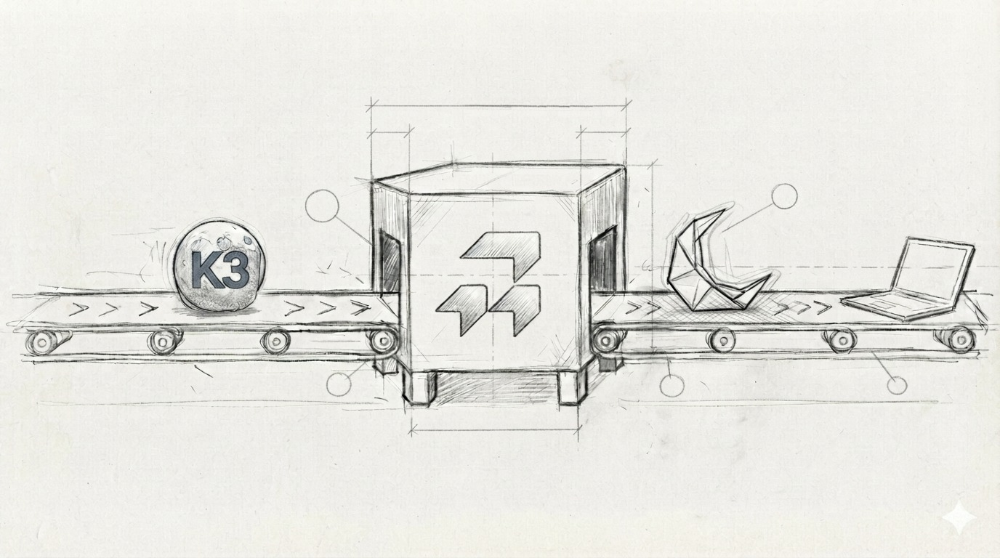
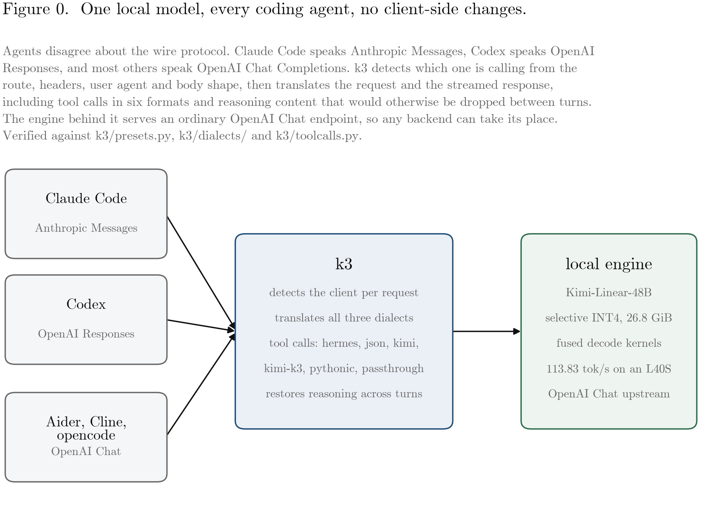
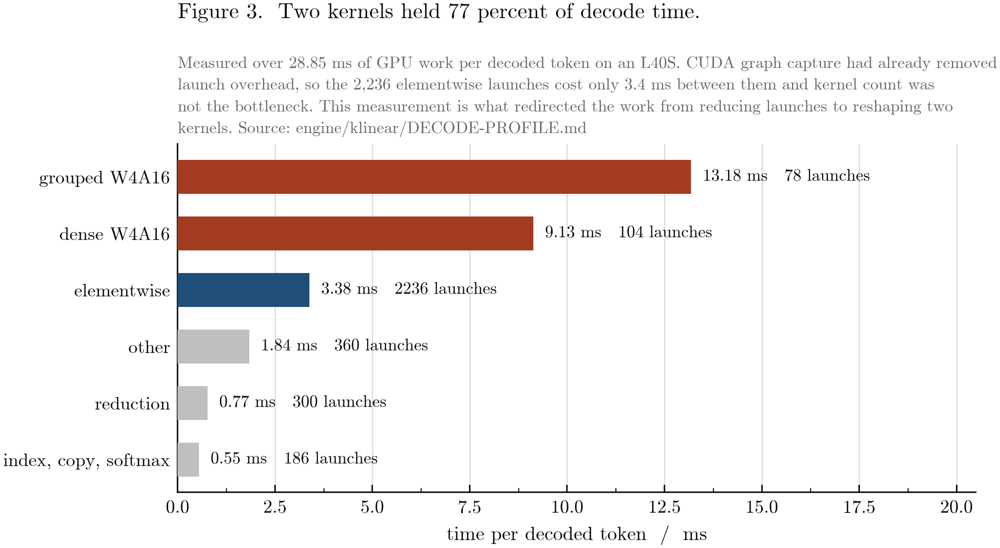
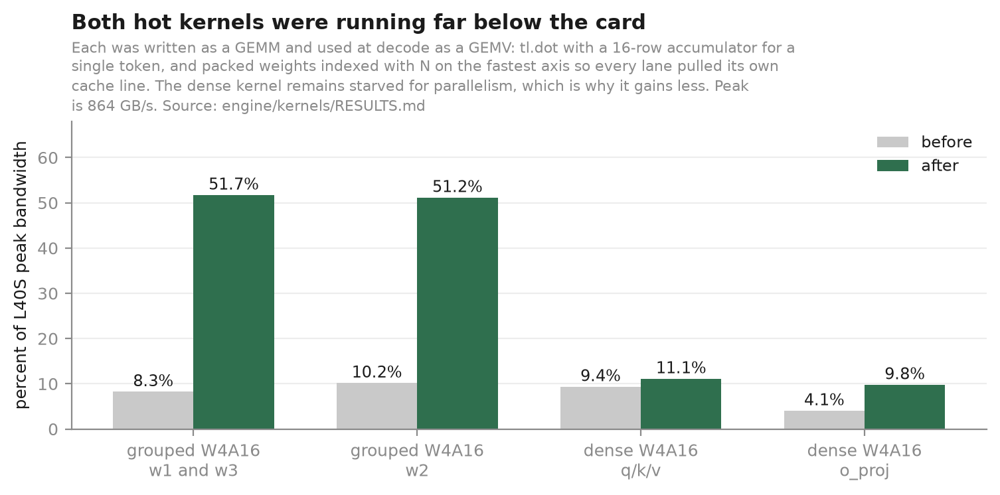
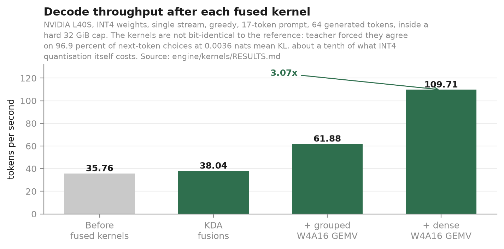
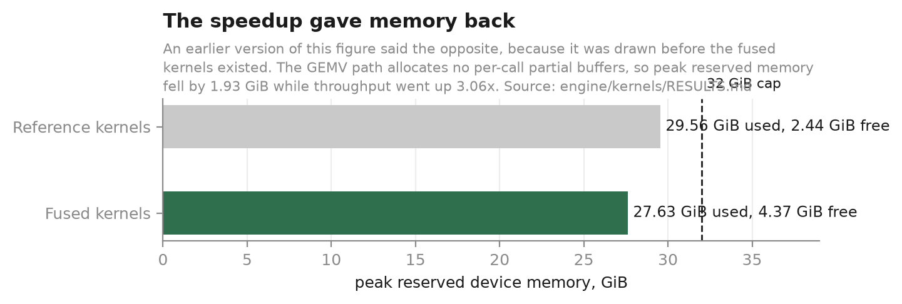

# local-kimi



<sub>The sketch is illustrative. The model behind this repository's measured 32 GiB result is Kimi-Linear-48B on an NVIDIA L40S under a hard 32 GiB process cap. Kimi K3 is 2.78T parameters and roughly 1.56 TB of weights. It does not run on a laptop, and this project does not claim that it does.</sub>

Point any coding agent at a local Kimi model and it works: `k3` translates between the agent's protocol and the model's.



## The problem

Local model servers usually speak OpenAI Chat Completions. Claude Code speaks Anthropic Messages. Codex speaks OpenAI Responses. Point the wrong client at the wrong endpoint and the request fails. `k3` sits between them, detects the caller on each request, and translates the request and response.

## Protocol support

The protocol landscape has changed. Current releases of [vLLM](https://docs.vllm.ai/en/stable/serving/online_serving/), [llama.cpp](https://github.com/ggml-org/llama.cpp/blob/master/tools/server/README.md), and [Ollama](https://docs.ollama.com/api/openai-compatibility) now document all three protocol families. `k3` is different because it is a standalone adapter for an existing OpenAI Chat Completions backend.

| Capability | vLLM | llama.cpp | Ollama | `k3` |
| --- | --- | --- | --- | --- |
| OpenAI Chat Completions | Documented | Documented | Documented | Verified |
| OpenAI Responses | Documented | Documented | Documented, non-stateful | Verified |
| Anthropic Messages | Documented | Documented | Documented | Verified |
| Serves model inference itself | Yes | Yes | Yes | No, proxy only |
| Detects a client preset from route, headers, user agent, and body hints | Not documented | Not documented | Not documented | Verified |
| Translates tool calls to and from a separate OpenAI Chat upstream | Not applicable | Not applicable | Not applicable | Verified |
| Ledger-backed reasoning restoration across client turns | Not documented | Not documented | Not documented | Verified when the backend supplies reasoning |

The vendor columns describe their public server documentation checked on July 29, 2026. "Not documented" is not a claim that the behavior is impossible. Ollama's [Anthropic compatibility](https://docs.ollama.com/api/anthropic-compatibility) is documented separately. The `k3` column is verified against [`k3/dialects/`](k3/dialects/), [`k3/detect.py`](k3/detect.py), [`k3/presets.py`](k3/presets.py), and [`k3/reasoning.py`](k3/reasoning.py).

## Quickstart with Claude Code

This path assumes an OpenAI-compatible Kimi server is already listening at `http://127.0.0.1:8000/v1`.

```bash
git clone https://github.com/RightNow-AI/local-kimi
cd local-kimi
uv sync --frozen
uv run k3 serve --upstream http://127.0.0.1:8000/v1 --model kimi-linear --reasoning-field inline
```

In another terminal, from the project Claude Code should work on:

```bash
export ANTHROPIC_BASE_URL=http://localhost:8080
export ANTHROPIC_AUTH_TOKEN=local
claude
```

The serve flags above are defined in [`k3/cli.py`](k3/cli.py). See the [full quickstart](docs/QUICKSTART.md) for llama.cpp setup, the model download, and troubleshooting.

## Measured here

- `k3` added **0.231 ms per request** in a local CPU-only ASGI benchmark that sent the same request directly to a stub backend and through the proxy. The benchmark used no socket or network. The host hardware was not recorded, so this number describes that run rather than a portable latency guarantee.
- The selective INT4 artifact is **28,803,304,448 bytes**, which is **3.41x smaller** than the **98,245,528,576-byte BF16 source tensor storage**. It was built and verified from the real checkpoint on one NVIDIA H100. See [`engine/quant/QUANTIZATION-RESULTS.md`](engine/quant/QUANTIZATION-RESULTS.md).
- The engine decodes at **113.83 tokens per second** on one NVIDIA L40S, up from **35.76** before the fused kernels, a **3.18x** gain. The run used one stream, a 17-token prompt, 64 generated tokens, greedy decoding, five repeats, and a hard 32 GiB process cap. Peak reserved memory fell from 29.56 GiB to 27.63 GiB. See [`engine/kernels/RESULTS.md`](engine/kernels/RESULTS.md) for the kernel-by-kernel breakdown and [`engine/klinear/DECODE-PROFILE.md`](engine/klinear/DECODE-PROFILE.md) for the profile that found the bottleneck.
- The fused kernels are **not bit-identical** to the reference path. Teacher-forced against the same token sequence they agree on **96.9%** of next-token choices with a mean KL of **0.0036 nats**. For scale, quantising the model to INT4 in the first place costs 85.16% agreement and 0.0555 nats, so the kernels are about a tenth of the divergence quantisation already introduced. Free-running greedy decode matches for roughly 24 tokens and then splits, which is what a different reduction order does once an argmax flips.

The **113.83 tokens per second** L40S engine result and llama.cpp's reported **roughly 32 tokens per second** on an RTX 3090 are not a comparison. The hardware and harnesses differ.

The INT4 artifact is not equivalent in quality to the BF16 source. [`engine/accuracy/RESULTS.md`](engine/accuracy/RESULTS.md) records the measured difference.

## Which GPUs this runs on

Be clear-eyed about this before you try it. The INT4 artifact holds **26.83 GiB**
of weights and needs roughly 2.5 GiB beyond that for activations, state and the
CUDA context.

| card | memory | runs today |
|---|---:|:---:|
| RTX 4080 | 16 GB | no |
| RTX 3090 | 24 GB | **no**, 2.83 GiB short |
| RTX 4090 | 24 GB | **no**, 2.83 GiB short |
| RTX 5090 | 32 GB | yes |
| L40S, A100, H100 | 48 GB and up | yes, the L40S is what was measured |

The 113.83 tokens per second figure is an L40S. **A 3090 or 4090 cannot load
this yet.** Fitting a 24 GB card needs the expert weights at three bits rather
than four, which brings the artifact to 21.28 GiB. That codec is implemented in
[`engine/quant/w3a16.py`](engine/quant/w3a16.py) but the checkpoint has not been
requantised, so it is not usable today. See
[`engine/CONSUMER-GPU.md`](engine/CONSUMER-GPU.md) for the arithmetic.

## How the engine got faster

For people who want the technical detail. Everything below is measured on one
NVIDIA L40S under a hard 32 GiB cap, and every figure names the document it came
from.

We profiled decode before changing anything. The result was not what we expected.
CUDA graph capture had already removed launch overhead, so the 2,236 elementwise
kernel launches per token cost only 3.4 ms between them. Two W4A16 kernels held
77 percent of the time.



Both of those kernels had been written as matrix-matrix multiplies and were being
used at decode as matrix-vector multiplies. They called `tl.dot` with a 16-row
accumulator to multiply a single token, throwing away fifteen sixteenths of the
work, and they indexed packed weights with the output dimension on the fastest
axis, so neighbouring threads pulled separate cache lines. Together that left
them running at 4 to 10 percent of the card's memory bandwidth.



Rewriting them as real GEMVs, with the reduction axis contiguous and a
single-row accumulator, took the grouped expert kernel from 8.3 to 51.7 percent
of peak.



The fused path also allocates no per-call partial buffers, so peak memory fell
while throughput rose.



Kernels live behind a registry in [`engine/kernels/registry.py`](engine/kernels/registry.py).
Each operation has one reference implementation and any number of variants, and
[`engine/kernels/equivalence.py`](engine/kernels/equivalence.py) compares every
variant against the reference. That is how a kernel gets swapped in without
guessing whether it changed the model.

**The fast kernels are on by default.** Nothing needs configuring to get the
number above. To go back to the reference path, or to try a variant that is
registered but switched off, set `KIMI_KERNELS`:

```bash
KIMI_KERNELS=w4a16_grouped=reference,w4a16_dense=reference   # the slow path
KIMI_KERNELS=w4a16_swiglu=fused                              # a fusion that measured slower
```

This ordering was a bug at first. The variants were registered but nothing
selected them, so an ordinary run silently got the reference path while the
benchmarks, which select variants explicitly, reported the fast one.
`tests/test_kernel_defaults.py` now pins the shipped default so that cannot
happen again.

Full numbers, including what we built and chose not to ship, are in
[`engine/kernels/RESULTS.md`](engine/kernels/RESULTS.md).

Every figure above is generated from the measured numbers by
[`scripts/make_figures.py`](scripts/make_figures.py) and is written twice, as PNG
and as vector PDF in [`docs/figures/`](docs/figures/) for use in a paper. Set
`USE_TEX=1` to render through a real LaTeX toolchain if one is installed;
without it the figures use Computer Modern through matplotlib's mathtext, which
matches.

```bash
uv run python scripts/make_figures.py
```

## Built by RunInfra

This project is built and maintained by [RunInfra](https://runinfra.ai/).

## Repository contents

| Path | Contents |
| --- | --- |
| `k3/` | Protocol detection, translation, streaming, tool calls, and reasoning restoration |
| `docs/` | Setup guides for Claude Code, Codex, the OpenAI SDK, and the adapter architecture |
| `engine/` | Kimi and Kimi-Linear experiments, measurements, and reference serving work |
| `tests/` | Protocol, regression, conformance, and overhead checks |
| `research/` | Exploratory scripts and recorded conclusions |
| `scripts/` | Repository helper scripts |
| `reference/` | Third-party Moonshot material used as a test oracle under its upstream terms |
| `assets/` | Images used by the documentation |

## Licence

See [LICENSE](LICENSE) and [LICENCE-DECISION.md](LICENCE-DECISION.md). Third-party files in `reference/` keep their upstream terms.
